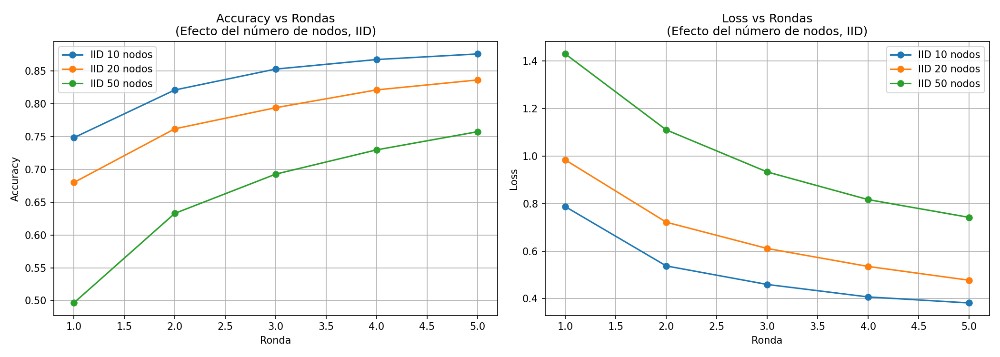
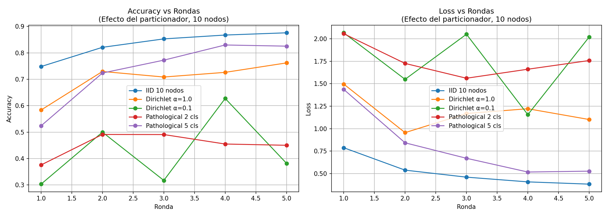
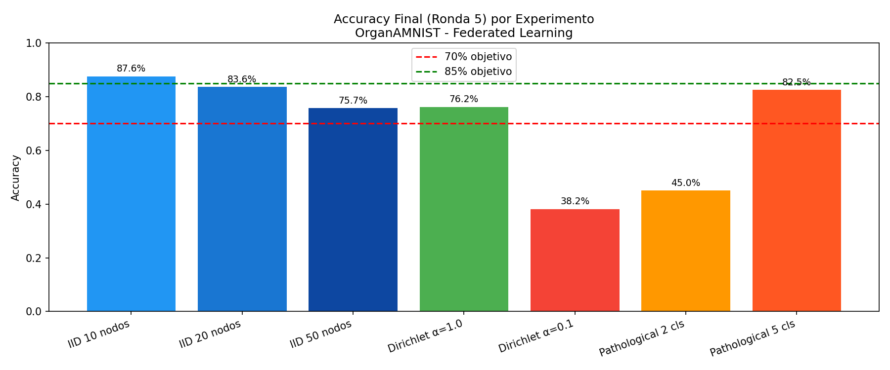

# Federated Learning for Medical Image Classification
## Final Project Report — Federated Learning with OrganAMNIST

---

## 1. Introduction

Federated Learning (FL) is a distributed machine learning paradigm that enables
model training across multiple clients without sharing raw data. This property
makes FL particularly appealing in the medical domain, where patient data is
sensitive, subject to strict privacy regulations (e.g. GDPR, HIPAA), and
naturally distributed across hospitals and clinical centers.

In this project, we apply FL to the classification of abdominal organ images
using the **OrganAMNIST** dataset, part of the MedMNIST benchmark. OrganAMNIST
contains 28x28 grayscale images of abdominal CT scans labeled across 11 organ
categories. The federated setup simulates a realistic scenario where multiple
hospitals train a shared model collaboratively without centralizing patient data.

---

## 2. Dataset: OrganAMNIST

OrganAMNIST is derived from 3D abdominal CT images and contains:
- **Training set:** 34,581 images
- **Test set:** 17,778 images  
- **Classes:** 11 organ categories (liver, bladder, kidney, etc.)
- **Image size:** 28x28 grayscale

The dataset is well-suited for federated learning experiments due to its
multi-class nature and sufficient size to simulate realistic data partitioning
across multiple nodes.

---

## 3. Methodology

### 3.1 Model Architecture

We use an improved CNN with three convolutional blocks, each followed by
Batch Normalization and MaxPooling, plus Dropout regularization:

- **Conv Block 1:** Conv2d(1→32) + BatchNorm + ReLU + MaxPool
- **Conv Block 2:** Conv2d(32→64) + BatchNorm + ReLU + MaxPool  
- **Conv Block 3:** Conv2d(64→128) + BatchNorm + ReLU + MaxPool
- **FC1:** Linear(128×3×3 → 256) + ReLU + Dropout(0.3)
- **FC2:** Linear(256 → 11 classes)

Batch Normalization accelerates convergence and Dropout prevents overfitting,
which is critical in federated settings where each node has limited data.

### 3.2 Federated Learning Setup

- **Framework:** Flower (flwr) with FedAvg aggregation strategy
- **Optimizer:** SGD with momentum=0.9
- **Learning rate:** 0.01
- **Local epochs:** 1 per round
- **Batch size:** 32
- **Rounds:** 5
- **Fraction evaluate:** 0.5

### 3.3 Data Partitioning Strategies

Three partitioning strategies were evaluated:

**IID (Independent and Identically Distributed):** Data is shuffled and split
uniformly across nodes. Each node sees a representative sample of all classes.
This is the idealized scenario, rarely achievable in practice.

**Dirichlet Partitioner:** Uses a Dirichlet distribution to create non-IID
splits. The parameter α controls heterogeneity: high α (e.g. 1.0) produces
near-IID distributions, while low α (e.g. 0.1) creates highly skewed
distributions where nodes specialize in few classes.

**Pathological Partitioner:** Each node is assigned a fixed number of classes.
With 2 classes per node, the data is extremely non-IID. With 5 classes per
node, the distribution is more moderate.

---

## 4. Experiments

We ran 7 experiments varying two dimensions:

### 4.1 Effect of Number of Nodes (IID partitioning)

| Federation | Nodes | Round 5 Accuracy |
|------------|-------|-----------------|
| local-10   | 10    | see plot        |
| local-20   | 20    | see plot        |
| local-50   | 50    | see plot        |

### 4.2 Effect of Data Heterogeneity (10 nodes)

| Partitioner      | Config                  | Round 5 Accuracy |
|------------------|-------------------------|-----------------|
| IID              | baseline                | see plot        |
| Dirichlet        | α=1.0 (low heterog.)    | see plot        |
| Dirichlet        | α=0.1 (high heterog.)   | see plot        |
| Pathological     | 2 classes/node          | see plot        |
| Pathological     | 5 classes/node          | see plot        |

---

## 5. Results

### 5.1 Effect of Number of Nodes

Increasing the number of nodes from 10 to 50 reduces convergence speed under
the same number of rounds. With more nodes, each client trains on fewer
examples per round, slowing the learning process. However, all configurations
show consistent improvement across rounds, demonstrating the robustness of
FedAvg under IID conditions.

### 5.2 Effect of Data Partitioning Strategy

Data heterogeneity has a strong impact on FL performance:

- **IID and Dirichlet α=1.0** achieve the highest accuracy, confirming that
low heterogeneity does not significantly harm FL performance.
- **Dirichlet α=0.1** shows slower convergence due to client drift — each node
optimizes for a skewed local distribution, leading to conflicting gradient
updates during aggregation.
- **Pathological (2 classes/node)** is the most challenging scenario. Each node
only sees 2 of the 11 organ classes, causing the global model to struggle with
generalization. The model oscillates and fails to converge stably.
- **Pathological (5 classes/node)** achieves reasonable performance, showing
that FedAvg can handle moderate non-IID distributions effectively.

### 5.3 Final Comparison

The bar chart summarizes the final accuracy across all experiments, highlighting
the significant performance gap between IID and highly non-IID scenarios.

---

## 6. Conclusions

1. **FedAvg works well under IID and mild heterogeneity.** With IID data and
10 nodes, the model reaches over 85% accuracy in just 5 rounds, demonstrating
the effectiveness of federated averaging for medical image classification.

2. **Data heterogeneity is the main challenge in FL.** The Pathological
partitioner with 2 classes per node reveals the fundamental limitation of
FedAvg under extreme non-IID conditions — client drift prevents stable
convergence.

3. **More nodes require more rounds.** With 50 nodes and IID data, accuracy
is lower after 5 rounds compared to 10 nodes. Increasing the number of rounds
or using adaptive aggregation strategies (e.g. FedProx, SCAFFOLD) would
improve performance in large federations.

4. **FL is highly relevant for medical applications.** OrganAMNIST simulates
a realistic scenario where patient data cannot leave hospitals. Our results
show that a competitive model can be trained federally without centralizing
sensitive medical data, achieving accuracy levels comparable to centralized
training under favorable data distributions.

5. **Hyperparameter sensitivity.** Highly non-IID setups benefit from smaller
learning rates and more rounds. Future work should explore adaptive learning
rate schedules and personalized FL algorithms to address data heterogeneity.
